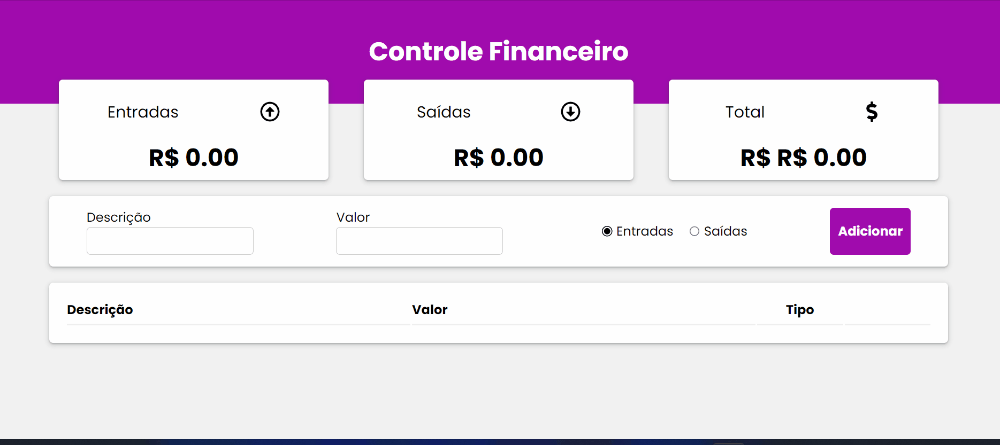

# App Controle Financeiro

App de controle financeiro criado usando <b>ReactJs</b> e <b>Styled-components</b>
Foram usados:

* localStorage;
* Reactjs;
* styled-components;
* react-icons;

## Veja o projeto completo:

https://app-financeiro-crud.netlify.app/

## Feito Com:

### Contato

  
   

Copyright © 2022 Keitey Lopes Barros

